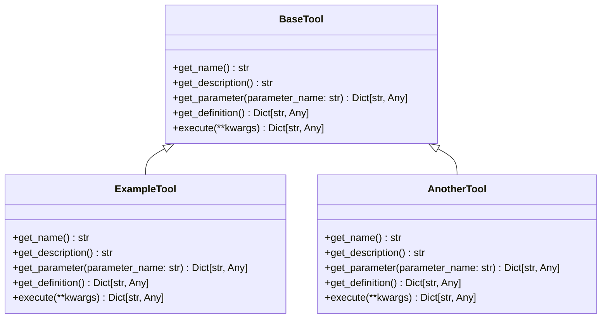

```mermaid
classDiagram
    class BaseTool {
        +get_name() str
        +get_description() str
        +get_parameter(parameter_name: str) Dict[str, Any]
        +get_definition() Dict[str, Any]
        +execute(**kwargs) Dict[str, Any]
    }

    class ExampleTool {
        +get_name() str
        +get_description() str
        +get_parameter(parameter_name: str) Dict[str, Any]
        +get_definition() Dict[str, Any]
        +execute(**kwargs) Dict[str, Any]
    }

    class AnotherTool {
        +get_name() str
        +get_description() str
        +get_parameter(parameter_name: str) Dict[str, Any]
        +get_definition() Dict[str, Any]
        +execute(**kwargs) Dict[str, Any]
    }

    BaseTool <|-- ExampleTool
    BaseTool <|-- AnotherTool
```